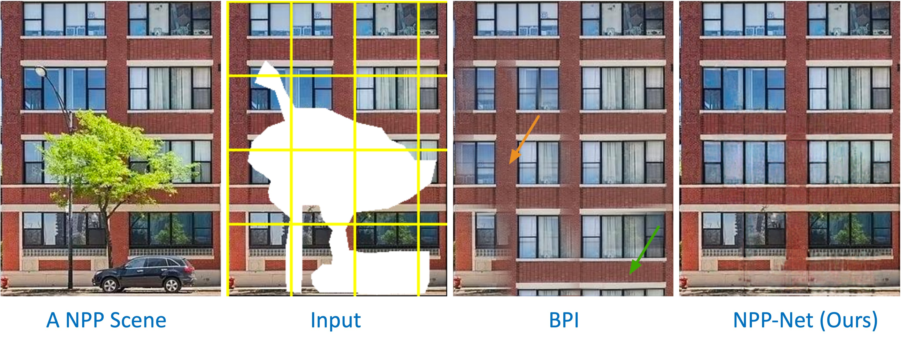

# Learning Continuous Implicit Representation for Near-Periodic Patterns (ECCV 2022)



## Get started
You can set up the environment with all dependencies like so:
```
conda create --name NPP-Net python=3.8.5
conda activate NPP-Net
pip install -r requirements.txt
```

## High-Level structure
* data: input examples for completion, remapping, and segmentation.
* externel_lib: externel library to support our code.
* loaders：dataloader
* models:  helper functions for model
* options: arguments for training.
* NPP_proposal: implementation for top-K periodicity proposal.
* NPP_completion: implementation for completion task. 
* NPP_segmentation: implementation for segmentation task. 
* NPP_remapping: implementation for remapping task. 


## NPP Completion

Run all examples in the "data/completion/input" using the following command.

```
bash run_completion.sh
```

This script first searches the periodicity of the image, saved in "data/completion/detected". 
Then it performs image completion, generating the outputs in "results/completion_top3".


## NPP Segmentation

Run all examples in the "data/segmentation/input" using the following command.

```
bash run_segmentation.sh
```

This script first searches the periodicity of the image, saved in "data/segmentation/detected". 
Then it performs image segmentation, generating the outputs in "results/segmentation_top3". 


## NPP Remapping

Run all examples in the "data/remapping/input" using the following command.

```
bash run_remapping.sh
```

This script first searches the periodicity of the image, saved in "data/remapping/detected". 
Then it performs image remapping, generating the outputs in "results/remapping_top3". 

The good results for each example can be achieved in 2800 epochs (testset_002800).

## Disclaimer

The result produced by this code might be slightly different when running on a different GPU. 

